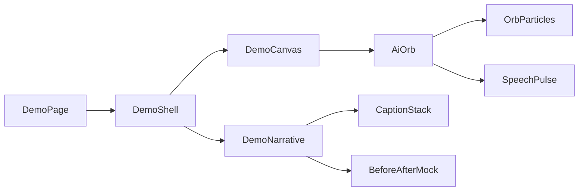

# AI Photo Retouching — Phase 0 + Auth/Roles

## Decision locked

- **Repo:** Replace the current interview monorepo in [`/Users/mdimam/Error/Roundtable`](/Users/mdimam/Error/Roundtable). Remove `services/interview`, `services/ai` (interview AI), recruiter/candidate app routes, and gateway fan-out. Keep the npm-workspaces + Docker idea, but retarget it to the proposal stack.
- **Backend shape:** One NestJS API (`services/api`) — modular monolith (not microservices). Matches the proposal: Nest + Socket.io later, Postgres, Valkey/Redis, MinIO locally.
- **Frontend:** Next.js App Router + Tailwind in `apps/web`, with strict feature-based folders and page → section → molecule → atom chaining.
- **Phase scope:** Scaffold + **7 public pages** + **auth/roles**. No credits/Stripe/AI provider/human pipeline yet (those are Weeks 2–5).

## Target monorepo layout

```text
apps/web/                 # Next.js + Tailwind
services/api/             # NestJS modular monolith
packages/shared/          # shared types/DTOs (roles, auth contracts)
prisma/                   # User, Role, Session (Phase 0)
docker-compose.yml        # postgres, redis, minio, mailpit, api, web
```

## Nest modular structure (`services/api`)

Each domain is a Nest module with `controller` / `service` / `dto` / (later) `entities`:

| Module | Phase 0 responsibility |
|--------|------------------------|
| `HealthModule` | `/health` |
| `AuthModule` | register, login, logout, refresh, email verify stubs, JWT cookies/Bearer |
| `UsersModule` | profile CRUD for current user |
| `RolesModule` | role enum + guards: `CLIENT`, `DESK`, `EDITOR`, `QA`, `ADMIN` |
| `MediaModule` | stub: MinIO client + signed URL helper (no full upload UX yet) |
| `ProjectsModule` | stub module + empty controller (wired for Week 1+) |
| `CreditsModule` | stub only |

**Auth/roles rules (MVP-aligned):**

- Public signup creates `CLIENT` only.
- `EDITOR` / `DESK` / `QA` / `ADMIN` are admin-provisioned later (no public editor signup).
- Nest guards: `JwtAuthGuard` + `RolesGuard` with `@Roles(...)`.
- Seed script: one `ADMIN` + demo `CLIENT`.

Prisma Phase 0 models: `User`, `Role` (enum), `Session`/`RefreshToken`, optional `EmailVerificationToken`.

## Public pages (7)

| Route | Purpose |
|-------|---------|
| `/` | Home — product story, CTAs to pricing + demo |
| `/pricing` | Credit packages / pay-as-you-go messaging (static until Stripe) |
| `/how-it-works` | AI path + human pipeline overview |
| `/products` | AI vs Human Basic/Standard/Advanced |
| `/demo` | **Interactive public demo** (Three.js) — what the platform will do |
| `/faq` | Common questions |
| `/about` | Company / trust |

Auth routes (not marketing, but Phase 0): `/sign-in`, `/sign-up`, `/verify-email` (stub), `/reset-password` (stub).

### `/demo` — talking AI orb (required)

Public page showing platform intent via motion, not a real AI job yet:

- Stack: `@react-three/fiber` + `@react-three/drei` + `three` (no Blender runtime; optional later GLB export if you want a custom mesh).
- Visual: **round particle/dot sphere** (orb) that **pulses, rotates, and “talks”** — mouth/energy ring or vertex displacement driven by a simple audio analyzer *or* a fake speech envelope when the scripted demo “speaks”.
- Overlay UI (component-chained): scripted captions (“Upload → AI enhance → rate batch → hand off to human”), before/after slider mock, CTA → `/sign-up`.
- Folder: `features/demo/` with `DemoCanvas`, `AiOrb`, `OrbParticles`, `SpeechPulse`, `DemoNarrative`, `DemoControls`.



## Frontend folder + naming conventions

```text
apps/web/
  app/
    (public)/
      layout.tsx              # PublicHeader + PublicFooter
      page.tsx                # home only — composes features/home
      pricing/page.tsx
      how-it-works/page.tsx
      products/page.tsx
      demo/page.tsx
      faq/page.tsx
      about/page.tsx
    (auth)/
      sign-in/page.tsx
      sign-up/page.tsx
      ...
  components/
    ui/                       # Button, Input, Container, SectionHeading...
    layout/                   # PublicHeader, PublicFooter, AuthShell
  features/
    home/sections/HeroSection/...
    pricing/sections/...
    demo/...                  # Three.js scene graph
    auth/...
  lib/
    api/                      # typed fetch to Nest
    auth/                     # session helpers
  styles/globals.css
```

**Rules for you + the other AI filling pages:**

1. **Pages are thin** — only compose feature sections; no large JSX in `page.tsx`.
2. **One section folder = one job** — e.g. `HeroSection/HeroSection.tsx` imports `HeroHeadline`, `HeroCtaGroup`, `HeroVisual`.
3. **Naming:** PascalCase components; kebab-case folders only if needed; props types as `HeroSectionProps`.
4. **Chaining depth:** `page` → `*PageView` → `*Section` → molecules → `components/ui` atoms.
5. **“Huge number of components”:** each public page ships a **section map** (8–12 sections) with stubbed child components so another AI can flesh copy/visuals without restructuring.

Example home chain: `HomePageView` → `HeroSection`, `SocialProofSection`, `ProductSplitSection`, `PipelineSection`, `CreditsTeaserSection`, `DemoCtaSection`, `FaqTeaserSection`, `FinalCtaSection` — each with 3–6 children.

## Docker / local Phase 0

Update [`docker-compose.yml`](/Users/mdimam/Error/Roundtable/docker-compose.yml) to: `postgres`, `redis`, `minio`, `mailpit`, `api`, `web`. Drop interview/ai/billing/gateway services.

Root scripts: `dev:web`, `dev:api`, `db:migrate`, `db:seed`.

## Implementation order

1. Wipe/repurpose workspace packages; create `services/api` Nest app + Prisma User/Role/Session.
2. Auth + Roles modules, guards, seed admin/client.
3. Scaffold `apps/web` structure, layout, UI primitives, API client.
4. Build all 7 public page shells with dense section/component trees (placeholder content OK).
5. Implement `/demo` Three.js orb + narrative overlay.
6. Wire sign-in/sign-up to Nest; protect a minimal `/app` redirect shell for authenticated clients (empty dashboard stub).
7. Docker Compose smoke: migrate, seed, register, login, open `/demo`.

## Explicitly out of Phase 0

Stripe, credit ledger, AI provider batches, human desk/editor/QA queues, Socket.io chat, editor payouts, R2 production, admin accounting UI.
